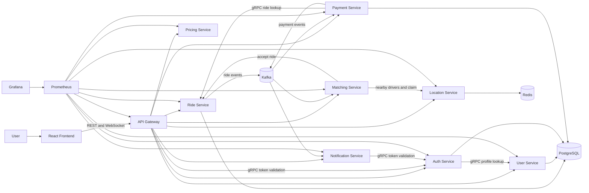

# Ride Sharing System

A full-stack ride sharing platform built with Go microservices, React, PostgreSQL, Redis, Kafka, gRPC, Docker, Prometheus, and Grafana.

The system supports rider and driver accounts, JWT authentication, fare estimation, ride requests, Redis-backed driver location and availability, automatic and manual driver matching, ride lifecycle transitions, mock payment authorization and capture, real-time ride notifications, and operational monitoring through Prometheus and Grafana.

## Table of Contents

- [Tech Stack](#tech-stack)
- [Features](#features)
- [How It Works](#how-it-works)
- [Ride Lifecycle](#ride-lifecycle)
- [Driver Location and Matching](#driver-location-and-matching)
- [Payments](#payments)
- [Notifications](#notifications)
- [Observability](#observability)
- [Architecture](#architecture)
- [Project Structure](#project-structure)
- [Requirements](#requirements)
- [Run with Docker](#run-with-docker)
- [Environment Configuration](#environment-configuration)
- [Local Development](#local-development)
- [Tests and Checks](#tests-and-checks)
- [Design Decisions](#design-decisions)
- [Known Limitations](#known-limitations)
- [Security Notes](#security-notes)
- [Possible Future Improvements](#possible-future-improvements)
- [License](#license)

## Tech Stack

### Backend

- Go
- Gin
- REST APIs
- JWT authentication
- PostgreSQL
- pgx
- Redis
- WebSockets
- gRPC
- Kafka

### Frontend

- React
- TypeScript
- Vite
- Vitest
- Playwright

### Infrastructure

- Docker
- Docker Compose
- GitHub Actions CI

### Observability

- Prometheus
- Grafana
- Go runtime metrics
- Business metrics for rides, payments, and matching

## Features

- Rider and driver registration and login
- JWT-protected API gateway
- User profile service
- Fare estimation
- Ride creation, acceptance, start, completion, and cancellation
- PostgreSQL-backed ride and payment persistence
- Service-created UUIDs for domain entities
- Redis-backed driver location storage
- Driver availability and unavailable state
- Nearby driver lookup
- Automatic background matching after payment authorization
- Manual match endpoint for testing and operational fallback
- Driver claim logic to prevent one driver matching multiple rides at once
- Ride status transition guards
- Mock payment authorization, capture, and refund flow
- Payment capture after completed rides
- Kafka ride and payment events
- WebSocket notifications for ride events
- Frontend role views for riders and drivers
- Frontend reset flow for repeated local testing
- Prometheus `/metrics` endpoints on every HTTP service
- Grafana dashboard for backend health and business metrics
- Dockerized local setup
- Backend module tests, frontend unit tests, browser smoke test, service smoke test, and gateway e2e flow

## How It Works

The application is split into small services. The frontend talks to the API gateway, and the gateway routes requests to backend services.

Riders can register, sign in, estimate a fare, request a ride, authorize payment, wait for matching, and observe ride updates.

Drivers can register, sign in, update their location, mark themselves available, accept rides, start rides, complete rides, and mark themselves unavailable.

Kafka is used for asynchronous events. Ride events feed notifications and payment capture. Payment authorization events feed background driver matching.

Redis is used for fast driver location and availability state. PostgreSQL stores durable user, auth, ride, and payment data.

## Ride Lifecycle

Rides move through guarded states:

- `requested`
- `accepted`
- `started`
- `completed`
- `cancelled`

The ride service enforces valid transitions. For example, a ride must be accepted before it can be started, and a completed ride cannot be cancelled.

Driver actions are authorized against the assigned driver. A second driver cannot accept an already accepted ride.

## Driver Location and Matching

Driver location and availability are stored in Redis.

The location service supports:

- updating a driver's current coordinates
- marking a driver available
- marking a driver unavailable
- finding nearby available drivers
- atomically claiming a driver for a match

Matching can happen in two ways:

- automatically after a payment is authorized
- manually through the match endpoint

Automatic matching runs in the background and retries while the ride is still waiting for a driver. If no drivers are available, the ride remains requested instead of being assigned incorrectly.

Driver claiming prevents the same available driver from being matched to two rides at the same time.

## Payments

The payment service implements a mock payment flow for local development and portfolio demonstration.

Payment states include:

- `authorized`
- `captured`
- `refunded`

Riders authorize payment after creating a ride. When a ride is completed, the payment service consumes the ride completion event and captures the authorized payment.

Refunds are available for captured payments and are used by the frontend reset flow during repeated local testing.

## Notifications

The notification service consumes Kafka ride events and sends real-time updates over authenticated WebSockets.

The frontend displays readable notifications instead of raw JSON event payloads.

Example notification events include:

- ride requested
- ride accepted
- ride started
- ride completed
- ride cancelled

## Observability

Every HTTP service exposes:

```text
/health
/metrics
```

Prometheus scrapes service metrics from the Docker Compose network.

Grafana is provisioned with a backend dashboard that includes:

- healthy backend service count
- metrics endpoint request rate
- Go heap allocation
- goroutine count
- ride lifecycle event counts
- payment lifecycle event counts
- matching attempts, successes, and no-driver outcomes

Business metrics include:

- `rideshare_ride_events_total`
- `rideshare_payment_events_total`
- `rideshare_matching_events_total`

## Architecture



## Project Structure

```text
backend/
  api-gateway/           Public REST entrypoint and JWT-protected routing
  auth-service/          Registration, login, JWT issuing, and gRPC token validation
  user-service/          Rider and driver profiles
  ride-service/          Ride lifecycle, persistence, gRPC ride lookup, and ride events
  location-service/      Redis-backed driver location and availability
  matching-service/      Nearby driver matching and background payment-event matching
  notification-service/  Kafka ride-event consumer and authenticated WebSockets
  pricing-service/       Fare estimates
  payment-service/       Mock payment authorization, capture, refunds, and payment events
  proto/                 gRPC protobuf definitions and generated Go code

frontend/
  src/
    components/          Shared UI components
    features/            Rider, driver, notification, and live-state panels
    hooks/               Local storage and notification hooks
    lib/                 API client and utilities
    pages/               Main route-level views
    types.ts             Shared TypeScript types
  tests/e2e/             Playwright browser smoke test

deployments/
  prometheus/            Prometheus configuration
  grafana/               Grafana provisioning and dashboard

tools/
  smoke/                 Health and metrics smoke checks
  e2e/                   Gateway end-to-end ride workflow
  test-all/              Backend module test runner
```

## Requirements

### Docker Setup

- Docker
- Docker Compose

### Local Development

- Go 1.26.5 or newer
- Node.js 22 or newer
- npm
- Docker, or locally installed PostgreSQL, Redis, and Kafka

## Run with Docker

### 1. Clone the repository

```sh
git clone https://github.com/ErenKarakus1/Ride-Sharing-System.git
cd Ride-Sharing-System
```

### 2. Start the application

```sh
docker compose up --build
```

Open:

- Frontend: http://localhost:5173
- API gateway: http://localhost:8088
- Prometheus: http://localhost:9090
- Grafana: http://localhost:3000

Docker Compose starts:

- `frontend` - React frontend served by Nginx
- `api-gateway` - public API entrypoint
- `auth-service` - authentication and token validation
- `user-service` - user profiles
- `ride-service` - ride lifecycle
- `location-service` - driver location and availability
- `matching-service` - automatic and manual driver matching
- `notification-service` - WebSocket notifications
- `pricing-service` - fare estimates
- `payment-service` - mock payment flow
- `postgres` - durable relational storage
- `redis` - fast driver state
- `kafka` - event broker
- `prometheus` - metrics collection
- `grafana` - dashboards

### Stop the application

```sh
docker compose down
```

### Stop the application and remove stored data

```sh
docker compose down -v
```

This removes the PostgreSQL and Grafana volumes created by Docker Compose.

## Environment Configuration

Docker Compose sets local-development defaults directly in `docker-compose.yml`.

Each backend service also includes its own `.env.example` file:

```text
backend/api-gateway/.env.example
backend/auth-service/.env.example
backend/user-service/.env.example
backend/ride-service/.env.example
backend/location-service/.env.example
backend/matching-service/.env.example
backend/notification-service/.env.example
backend/pricing-service/.env.example
backend/payment-service/.env.example
```

The frontend environment template is located at:

```text
frontend/.env.example
```

For local frontend development:

```text
VITE_API_BASE_URL=http://localhost:8088
```

Do not commit real `.env` files, API keys, access tokens, passwords, database URLs, or production secrets.

## Local Development

The simplest local workflow is to run infrastructure and services through Docker Compose.

For direct service development, each Go service is a separate module with its own `cmd/server/main.go`.

### Run backend module tests

From the repository root:

```sh
cd tools/test-all
go run .
```

### Run the frontend locally

Open another terminal:

```sh
cd frontend
npm install
npm run dev
```

The Vite development server runs at:

```text
http://localhost:5173
```

### Run one Go service directly

Start the required infrastructure first, then run a service from its module directory.

Example:

```sh
cd backend/pricing-service
go run ./cmd/server
```

Services that depend on PostgreSQL, Redis, Kafka, or other internal services need matching environment variables from their `.env.example` files.

## Tests and Checks

### Backend module tests

```sh
cd tools/test-all
go run .
```

This runs `go test ./...` across backend modules and Go tooling modules.

### Frontend checks

```sh
cd frontend
npm install
npm run typecheck
npm test
npm run build
```

### Frontend browser smoke test

```sh
cd frontend
npx playwright install chromium
npm run e2e
```

### Docker Compose validation

```sh
docker compose config
```

### Service smoke checks

Start the stack first:

```sh
docker compose up --build -d frontend
```

Then run:

```sh
cd tools/smoke
go run .
```

The smoke tool checks `/health` and `/metrics` for every backend HTTP service.

### Gateway end-to-end flow

With the Docker stack running:

```sh
cd tools/e2e
go run .
```

The e2e flow verifies:

- rider registration and login
- driver registration and login
- fare estimate creation
- ride creation
- driver location and availability
- payment authorization
- automatic matching
- second driver cannot accept an already accepted ride
- same driver cannot match a second ride while claimed
- unavailable driver cannot be matched
- ride start and completion
- ride completed notification
- payment capture after completion

### CI

GitHub Actions runs:

- backend module tests
- frontend dependency install
- frontend typecheck
- frontend unit tests
- frontend production build
- Playwright browser smoke test
- Docker Compose config validation
- Docker stack startup
- backend health and metrics smoke checks
- gateway e2e flow

## Design Decisions

### Microservice Boundaries

The backend is split by domain responsibility: authentication, users, rides, location, matching, notifications, pricing, and payments.

This makes the service communication patterns visible and keeps each service focused.

### API Gateway

The frontend talks to a single API gateway instead of directly calling every backend service.

The gateway validates JWTs and forwards requests to internal services.

### gRPC for Internal Identity and Ride Lookups

The auth service exposes token validation over gRPC so the gateway and notification service can authenticate requests without duplicating JWT logic.

The ride service exposes ride lookup over gRPC so the payment service can validate payment requests against ride state.

### Kafka for Domain Events

Ride and payment events are published to Kafka so services can react asynchronously.

Notifications, payment capture, and background matching are event-driven rather than tightly coupled to the original HTTP request.

### Redis for Fast Driver State

Driver location and availability are fast-changing operational state, so Redis is used instead of PostgreSQL for nearby-driver matching.

Availability uses TTL-backed state so stale drivers are ignored.

### Concurrency in Matching

Matching uses an atomic Redis claim operation before accepting a ride.

Ride acceptance also uses guarded status updates so two drivers cannot accept the same ride at the same time.

### Payment Model

Payments are intentionally mocked. The goal is to model the state machine and service boundaries without integrating a real payment provider.

### Observability

Every service exposes Prometheus metrics. Business counters are added for ride lifecycle events, payment lifecycle events, and matching outcomes so Grafana can show system behavior beyond process health.

## Known Limitations

- Payments are mocked and do not integrate with a real payment provider.
- Driver matching uses a simple nearest-driver strategy.
- The frontend is designed for local demonstration rather than production-scale dispatch operations.
- Kafka is run as a single local broker.
- PostgreSQL uses a single local database for all database-backed services.
- Docker Compose is intended for local development and demonstration, not hardened production deployment.
- Authentication tokens are stored in browser local storage. A production-oriented design could use HttpOnly, Secure, SameSite cookies for refresh tokens.
- No distributed tracing is configured.

## Security Notes

- Never commit real `.env` files.
- Never commit real JWT secrets, database credentials, API keys, access tokens, or payment provider credentials.
- Replace local JWT and internal service tokens before any deployment.
- Restrict CORS and WebSocket origins in production.
- Use TLS for deployed services.
- Do not expose PostgreSQL, Redis, or Kafka publicly.
- Use separate database credentials per service in production.
- Treat the Docker Compose configuration as a local-development setup.

## Possible Future Improvements

- Real payment provider integration
- Driver mobile app flow
- Rider trip history page
- Admin dashboard
- Service-specific PostgreSQL databases
- OpenTelemetry tracing
- Structured logging and log aggregation
- More detailed Grafana dashboards
- Sliding-window or token-bucket rate limiting
- Map visualization for pickup, dropoff, and driver location
- Driver ETA calculation
- Surge pricing rules
- Ride cancellation fees
- CI workflow split between fast checks and Docker e2e checks
- Production deployment manifests

## License

This project is licensed under the [MIT License](LICENSE).
